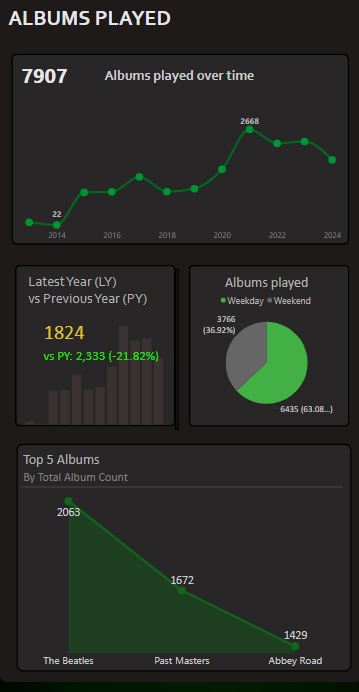
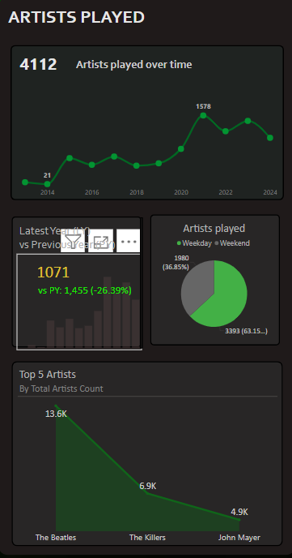
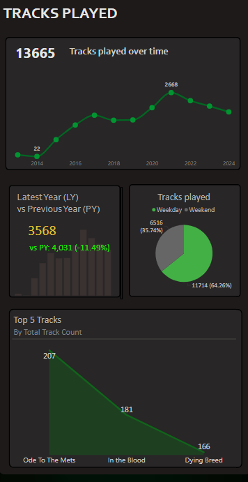
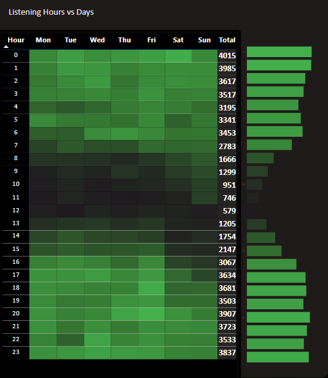
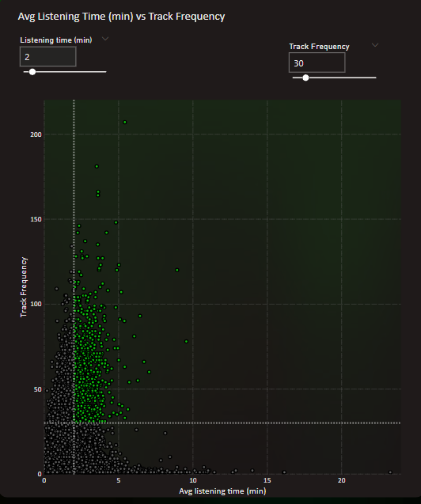

# Spotify Analytics Dashboard (Power BI)

> Built an interactive dashboard to analyze user listening behavior, uncover engagement patterns, and identify content performance trends.

---

## 📸 Dashboard Preview

### Albums Analysis

### Artists Analysis

### Tracks Analysis

### Listening Behavior

### Engagement Analysis

---

## 📊 Overview
This project analyzes Spotify listening data across albums, artists, and tracks to uncover meaningful patterns in user engagement.

The dashboard focuses on:
- Time-based listening trends  
- Content performance (albums, artists, tracks)  
- User behavior segmentation (weekday vs weekend)  
- Year-over-year growth analysis  

---

## 🔍 Key Insights
- Identified peak listening periods across hours and days  
- Highlighted top-performing artists, albums, and tracks  
- Observed differences in weekday vs weekend listening behavior  
- Analyzed year-over-year trends in engagement  
- Segmented content based on frequency vs listening time  

---

## 📈 Dashboard Features

### Albums Analysis
- Monthly and yearly listening trends  
- Top 5 most played albums  
- Weekday vs weekend segmentation  
- Year-over-year growth comparison  

### Artists Analysis
- Artist engagement trends over time  
- Diversity of artists across years  
- Top-performing artists identification  
- YoY comparison of listening patterns  

### Tracks Analysis
- Track-level listening behavior trends  
- Frequency-based top tracks  
- Time-based segmentation insights  
- Comparative yearly analysis  

### Listening Behavior Insights
- Heatmap of listening activity across hours and days  
- Quadrant analysis (frequency vs listening time):
  - High engagement users  
  - Casual listeners  
  - Niche content patterns  

---

## ⚙️ Tools & Techniques
- Power BI  
- Data Modeling & Relationships  
- DAX (Data Analysis Expressions)  
- Time Intelligence Functions  
- Interactive Visualizations  

---

## 📊 Dataset
- spotify_history.csv

---

## 📬 Contact
samarthj5923@gmail.com
